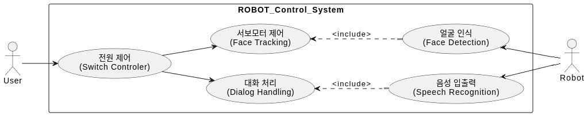

# 사용자의 얼굴을 바라보며 대화하는 LLM 탑재 로봇

[Intel] 엣지 AI SW 아카데미 13기: 인텔 최종 프로젝트

Face Tracking 기능을 수행하고 LLM을 탑재하여 사용자와 대화를 할 수 있는 로봇을 구현하는 프로젝트입니다.

본 프로젝트에서 구현하고자 하는 기능은 다음과 같습니다.
* 사용자의 얼굴을 카메라로 감지하고, 사용자의 얼굴을 따라 로봇의 머리가 움직이는 동작을 수행합니다.
* 로봇에 장착된 마이크와 스피커를 통해 음성으로 대화를 주고받습니다.
* 로봇의 머리에 장착된 OLED로 로봇의 감정 상태를 표현합니다.
* (여유가 된다면 추가 기능을 탑재할 계획입니다.)

## High Level Design
### 프로젝트 아키텍처

```
┌─────────────────────────────────────────────────────────────────┐
│                        로봇 시스템 전체 구조                        │
├─────────────────────────┬───────────────────────────────────────┤
│   라즈베리파이 4 (몸체)    │        ESP32-S3-CAM (머리)          │
│                        │                                     │
│  ┌─────────────────┐    │   ┌─────────────────────────────┐    │
│  │   메인 처리      │    │   │      센서/액추에이터        │    │
│  │ ◆ STT/TTS       │    │   │ ◆ Face Detection           │    │
│  │ ◆ LLM API       │    │   │ ◆ 서보모터 제어             │    │
│  │ ◆ OLED 표정      │    │   │ ◆ 카메라 관리               │    │
│  └─────────────────┘    │   └─────────────────────────────┘    │
│                        │                                     │
│  ┌─────────────────┐    │   ┌─────────────────────────────┐    │
│  │   연결 장치      │    │   │        연결 장치            │    │
│  │ ◆ USB 마이크     │    │   │ ◆ OV2640 카메라            │    │
│  │ ◆ USB 스피커     │    │   │ ◆ 서보모터 x2              │    │
│  │ ◆ OLED 디스플레이│    │   │                           │    │
│  └─────────────────┘    │   └─────────────────────────────┘    │
│                        │                                     │
│  ┌─────────────────┐    │   ┌─────────────────────────────┐    │
│  │     전원 시스템   │    │   │        전원 시스템          │    │
│  │ USB-C 어댑터     │    │   │ 5V 어댑터                  │    │
│  │ 5V/3A (15W)     │    │   │ 5V/2A (10W)               │    │
│  └─────────────────┘    │   └─────────────────────────────┘    │
└─────────────────────────┴───────────────────────────────────────┘
                          │
                ┌─────────┴─────────┐
                │   UART 유선 연결   │
                │ ◆ TX/RX 통신      │
                │ ◆ 공통 GND        │
                │ ◆ 지연: 1-5ms     │
                └───────────────────┘
```

### 시스템 구성 요소

- **메인 처리 모듈**: 라즈베리파이 4 (AI 음성 대화, 표정 제어, 시스템 조율)
- **센서/액추에이터 모듈**: ESP32-S3-CAM (Face Detection + 서보모터 제어)
- **통신 방식**: UART 유선 연결 (TX/RX + GND)
- **전원 구조**: 독립형 이중 전원 (USB-C + 5V 어댑터)
- **물리적 배치**: 몸통(라즈베리파이) + 머리(ESP32) + 연결 케이블

### 유스케이스 시나리오


### 유스케이스 다이어그램

## Clone code

프로젝트를 clone하는 방법을 설명합니다.

```shell
git clone https://github.com/LES4975/my-little-chatbot.git
```

## Prerequite

* (프로잭트를 실행하기 위해 필요한 dependencies 및 configuration들이 있다면, 설치 및 설정 방법에 대해 기술)

```shell
python -m venv .venv
source .venv/bin/activate
pip install -r requirements.txt
```

## Steps to build

* (프로젝트를 실행을 위해 빌드 절차 기술)

```shell
cd ~/xxxx
source .venv/bin/activate

make
make install
```

## Steps to run

* (프로젝트 실행방법에 대해서 기술, 특별한 사용방법이 있다면 같이 기술)

```shell
cd ~/xxxx
source .venv/bin/activate

cd /path/to/repo/xxx/
python demo.py -i xxx -m yyy -d zzz
```

## Output

* (프로젝트 실행 화면 캡쳐)


## Appendix

* (참고 자료 및 알아두어야할 사항들 기술)

