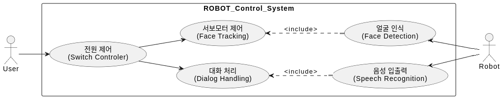
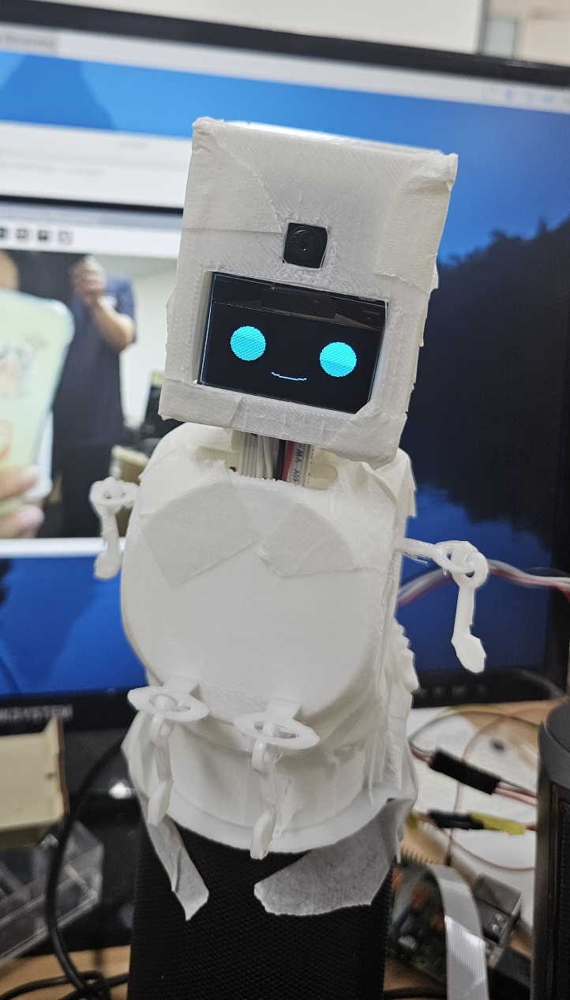

# 사용자의 얼굴을 바라보며 대화하는 LLM 탑재 로봇

[Intel] 엣지 AI SW 아카데미 13기: 인텔 최종 프로젝트

Face Tracking 기능을 수행하고 LLM을 탑재하여 사용자와 대화를 할 수 있는 로봇을 구현하는 프로젝트입니다.

본 프로젝트에서 구현하고자 하는 기능은 다음과 같습니다.
* 사용자의 얼굴을 카메라로 감지하고, 사용자의 얼굴을 따라 로봇의 머리가 움직이는 동작을 수행합니다.
* 로봇에 장착된 마이크와 스피커를 통해 음성으로 대화를 주고받습니다.
* 로봇의 머리에 장착된 OLED로 로봇의 감정 상태를 표현합니다.

## High Level Design
### 프로젝트 아키텍처

```
┌──────────────────────────┐    ┌──────────────────────────┐
│  라즈베리파이4 #1 시스템   │    │  라즈베리파이4 #2 시스템   │
├──────────────────────────┤    ├──────────────────────────┤
│   라즈베리파이 4           │    │   라즈베리파이 4           │
│                          │    │                          │
│  ┌───────────────┐       │    │  ┌───────────────┐       │
│  │   메인 처리    │       │    │  │   메인 동작    │       │
│  │ ◆ STT/TTS    │       │    │  │◆ Face Detection│       │
│  │ ◆ LLM API    │       │    │  │◆ 서보모터 제어 │       │
│  │ ◆ OLED 표정   │       │    │  │◆ 카메라 관리   │       │
│  └───────────────┘       │    │  └───────────────┘       │
│                          │    │                          │
│  ┌───────────────┐       │    │  ┌───────────────┐       │
│  │   연결 장치    │       │    │  │   연결 장치    │       │
│  │ ◆ bluetooth 마이크│    │    │  │ ◆ OV2640 카메라│       │
│  │ ◆ USB 스피커   │       │    │  │ ◆ SG90서보모터x2│      │
│  │ ◆ OLED 디스플레이│     │    │  │               │       │
│  └───────────────┘       │    │  └───────────────┘       │
│                          │    │                          │
│  ┌───────────────┐       │    │  ┌───────────────┐       │
│  │   전원 시스템   │       │    │  │   전원 시스템   │       │
│  │ 전원 어댑터     │       │    │  │ 전원 어댑터     │       │
│  └───────────────┘       │    │  └───────────────┘       │
└──────────────────────────┘    └──────────────────────────┘
              
```


### 유스케이스 시나리오


### 유스케이스 다이어그램

## Clone code

프로젝트를 clone하는 방법을 설명합니다.

```shell
git clone https://github.com/LES4975/my-little-chatbot.git
```

이 프로젝트에는 세 가지의 실행 환경(Face Tracking용 라즈베리파이, LLM 대화 처리용 라즈베리파이, 외부 GPU 서버)에 사용해야 하는 코드가 모두 들어있습니다.
프로젝트를 clone한 뒤, 필요한 코드를 각 환경에 저장합니다.

- LLM 대화 처리용 라즈베리파이에는 본 프로젝트를 clone하기만 하면 됩니다.
- Face Tracking용 라즈베리파이에는 본 프로젝트의 [face_tracking]('./face_tracking/') 디렉토리에 있는 [face_tracking.py]('./face_tracking/face_tracking.py')를 저장해야 합니다.
- 외부 GPU 서버에는 본 프로젝트의 [code_in_server]('./code_in_server/') 디렉토리에 있는 코드들을 전부 저장해야 합니다.

## Prerequite
모든 개발환경에서 가상환경을 만들고 필요한 패키지를 설치합니다.
```shell
python -m venv .venv
source .venv/bin/activate
pip install -r requirements.txt
```


## Steps to run

가상환경을 각 환경에서 실행합니다.
```shell
cd ~/xxxx
source .venv/bin/activate
```

- Face Tracking용 라즈베리파이의 경우, Face Tracking 기능을 작동시키기 위해서는 아래 커맨드를 입력해야 합니다.
```
sudo pigpiod
python face_tracking.py
```

- 미리 저장해 둔 STT/TTS API 키를 환경변수로 설정합니다. 설정했다면, LLM 대화용 라즈베리파이에서 main.py를 실행합니다.
```
python main.py
```

- 외부 GPU 서버에서는 server.py를 실행합니다.
```
python server.py
```

외부 GPU 서버와 LLM 대화용 라즈베리파이가 FastAPI로 통신하기 위해서 SSH 키 설정이 필요할 수도 있습니다.

## Output



[](https://youtube.com/shorts/ceVe-onRdo8?feature=share)

## Appendix
- 카메라 변경시 reboot 후 다시 실행해야합니다.
- 추후 업그레이드할 여지가 있습니다.

## Credits

### Language Model
- **Midm-2.0**: [K-intelligence-Midm](https://github.com/K-intelligence-Midm/Midm-2.0)

### APIs
- **STT (Speech-to-Text)**: [OpenAI API](https://openai.com/api/)
- **TTS (Text-to-Speech)**: [Google Cloud Platform](https://cloud.google.com/text-to-speech)


